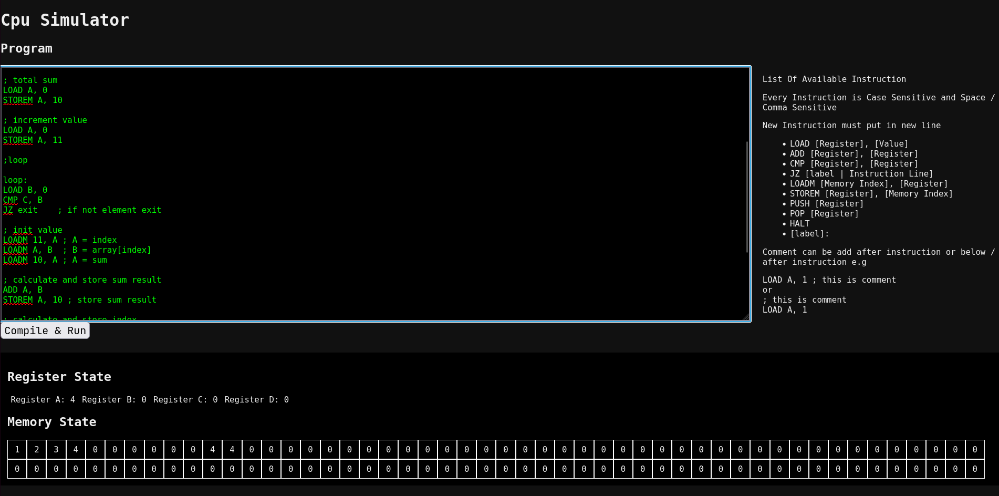

# CPU-SIM

A small CPU simulation project built out of curiosity about how CPUs actually work, and as a way to learn Java by going closer to the metal.



## Description

CPU-SIM is a minimal CPU simulator with:

- 4 general-purpose registers  
- 100 memory locations  

The goal is not performance or realism, but understanding: how instructions are executed, how state changes over time, and why CPUs are structured the way they are.

## Current Features

- Basic instruction execution  
- Fixed-size register set  
- Simple memory model  

## Future Plans

- Add more instructions  
- Add a step-by-step execution mode (for debugging and learning)  
- Improve the UI  
  - Possibly visualize memory locations and register states

## Example

```asm
```asm
; create array
LOAD A, 1
STOREM A, 0

LOAD A, 2
STOREM A, 1

LOAD A, 3
STOREM A, 2

LOAD A, 4
STOREM A, 3

LOAD C, 4

; total sum
LOAD A, 0
STOREM A, 10

; increment value
LOAD A, 0
STOREM A, 11

;loop

loop:
LOAD B, 0
CMP C, B
JZ exit    ; if not element exit

; init value
LOADM 11, A ; A = index
LOADM A, B  ; B = array[index]
LOADM 10, A ; A = sum

; calculate and store sum result
ADD A, B
STOREM A, 10 ; store sum result

; calculate and store index
LOADM 11, A
LOAD B, 1
ADD A, B
STOREM A, 11 ; store index result

SUB C, B
JMP loop

exit:
LOADM 10, A
HALT
```
